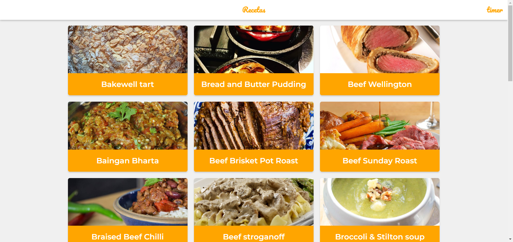

# Recetas

PWA that uses the MealDB API to display recipes with their instructions.
Some of the features it has are:

* Offline support with Workbox
* Appropriate Network Strategies for each resource
* Add to Home Screen
* Web Share API
* Notifications

[See the app on production] (https://recipes.wflorez52.now.sh/)

## Scripts

* `npm install` to install the dependencies
* `npm run dev` to run development enviroment
* `npm run build && npm run start` to run production enviroment

## License

MIT

* This project was bootstrapped with [Create React App]

(https://github.com/facebookincubator/create-react-app).

